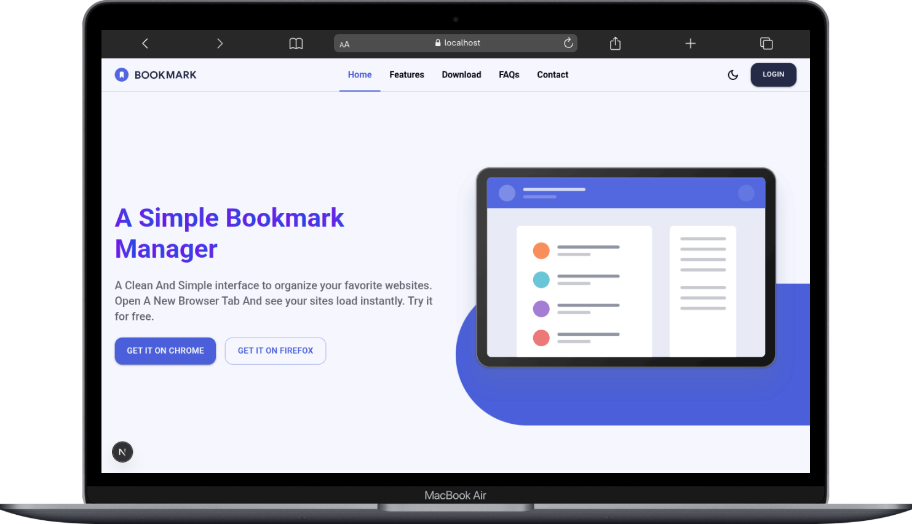
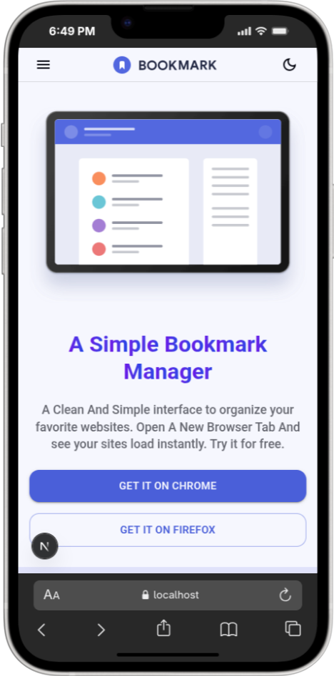
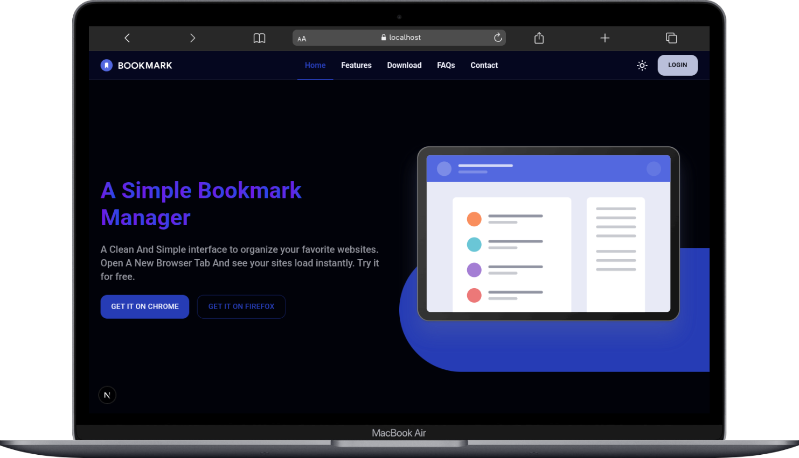
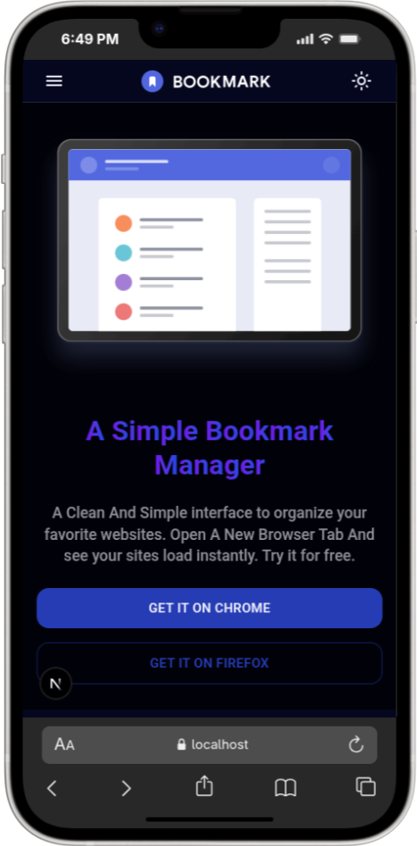

# Simple Bookmark Landing Page

A clean and responsive landing page for a bookmark manager. This project is **frontEnd** only (no functionality), built with **Next.js**, **Tailwind CSS**, and **MUI (Material-UI)**, enhanced with **GSAP Animations** for smooth interactions.

### Light Mode

<<<<<<< HEAD
| Desktop                                                  | Mobile                                                     |
| -------------------------------------------------------- | ---------------------------------------------------------- |
=======
| Desktop                                                        | Mobile                                                           |
| -------------------------------------------------------------- | ---------------------------------------------------------------- |
>>>>>>> eefb4ed (Add Live Demo Link)
|  |  |

### Dark Mode

<<<<<<< HEAD
| Desktop                                                | Mobile                                                   |
| ------------------------------------------------------ | -------------------------------------------------------- |
=======
| Desktop                                                      | Mobile                                                         |
| ------------------------------------------------------------ | -------------------------------------------------------------- |
>>>>>>> eefb4ed (Add Live Demo Link)
|  |  |

[](https://opensource.org/licenses/MIT)


[Live Demo](https://wolf-bookmark.vercel.app)

---

## Table of Contents

- [About](#about)
- [Features](#features)
- [Tech Stack](#tech-stack)
- [Installation](#installation)
- [Contributing](#contributing)
- [License](#license)

---

## About

This is a **Simple Bookmark Landing Page** built for practicing frontend development with modern tools.
It features a **responsive design** using **Next.js**, **Tailwind CSS**, and **MUI (Material-UI)** components.
The page includes **smooth GSAP animations** and supports **Dark and Light themes**, allowing users to switch between modes seamlessly.

The project is **frontEnd only**, so it does not include any backend functionality.

---

## Features

- **Responsive Design:** Works perfectly on desktop, tablet, and mobile screens.
- **Dark/Light Theme:** Switch between dark and light modes seamlessly.
- **GSAP Animations:** Smooth animations for interactive and engaging UI.
- **MUI Components:** Built with Material-UI for consistent and modern design.
- **Tailwind CSS Styling:** Utility-first styling for fast and flexible layout.
- **FrontEnd Only:** Focused on layout and user interface, no backend functionality.

---

## Tech Stack

- **Next.js** – React framework for server-side rendering and routing
- **React** – JavaScript library for building user interfaces
- **Tailwind CSS** – Utility-first CSS framework for rapid styling
- **MUI (Material-UI)** – Pre-built React components for consistent design
- **GSAP** – JavaScript library for smooth animations
- **next-themes** – Theme management for switching between Dark and Light modes
- **JavaScript / TypeScript** – Core programming language used

---

## Installation

1. Clone the repository:

```bash
git clone https://github.com/Wolf-Root/Bookmark.git
```

2. Install dependencies:

```bash
npm install
```

3. Run the development server:

```bash
npm run dev
```

Open http://localhost:3000 in your browser to view the project.

---

## Contributing

1. Fork the repository
2. Create a feature branch:

```bash
git checkout -b feature/AmazingFeature
```

3. Commit your changes:

```bash
git commit -m "Add some AmazingFeature"
```

4. Push to your branch:

```bash
git push origin feature/AmazingFeature
```

5. Open a Pull Request

---

## License

This project is distributed under the MIT License. See LICENSE for more information.
